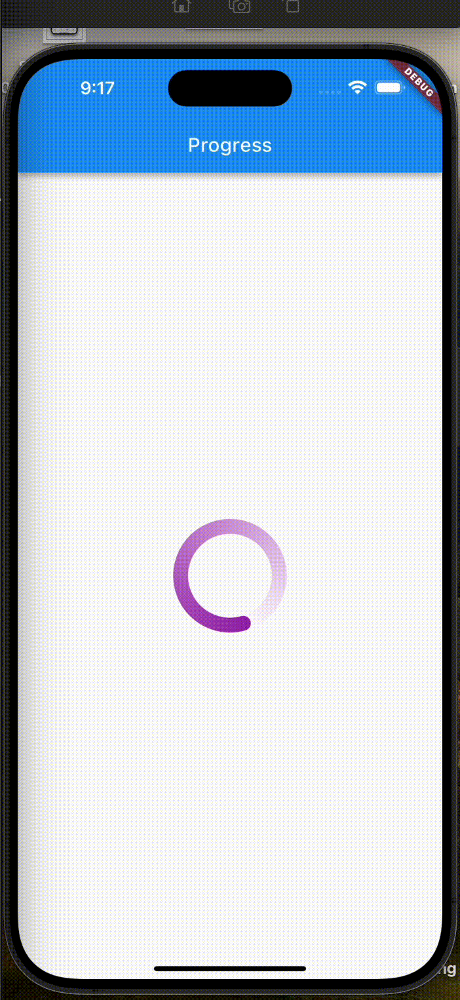
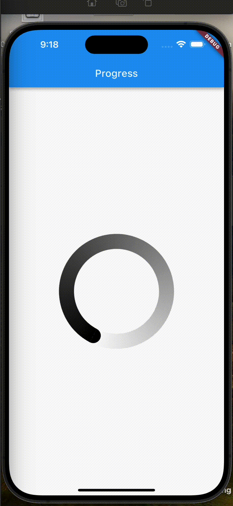

# CircularGradientSpinner

A Flutter package that provides a customizable, animated, gradient circular progress indicator. `CircularGradientSpinner` is perfect for adding a visually appealing and informative progress indicator to your Flutter applications.




## Features

- **Customizable Gradient**: Easily customize the colors of the gradient.
- **Animation Control**: Comes with built-in animation that can be customized or controlled as needed.
- **Highly Customizable**: Adjust the size, stroke width, gradient steps, and more.

## Getting Started

To use this package, add `gradient_round_paint` as a dependency in your `pubspec.yaml` file.

```yaml
dependencies:
  circular_gradient_spinner: ^1.0.0
```

```dart
import 'package:flutter/material.dart';
import 'package:circular_gradient_spinner/circular_gradient_spinner.dart';

void main() {
  runApp(MyApp());
}

class MyApp extends StatelessWidget {
  @override
  Widget build(BuildContext context) {
    return MaterialApp(
      home: Scaffold(
        appBar: AppBar(
          title: Text('Circular Gradient Spinner'),
        ),
        body: Center(
          child: CircularGradientSpinner(
            color: Colors.blue,
            size: 200,
            strokeWidth: 20,
          ),
        ),
      ),
    );
  }
}
```

## Customization

CircularGradientSpinner can be customized with the following parameters:

color: Base color of the gradient.
size: Diameter of the circle.
strokeWidth: Width of the stroke.
duration: Duration of the animation.
gradientSteps: Number of steps in the gradient.

## Contributing

Contributions are what make the open-source community such an amazing place to learn, inspire, and create. Any contributions you make are greatly appreciated.

If you have a suggestion that would make this better, please fork the repository and create a pull request. You can also simply open an issue with the tag "enhancement".
Don't forget to give the project a star! Thanks again!

## Fork the Project

Create your Feature Branch (git checkout -b feature/AmazingFeature)
Commit your Changes (git commit -m 'Add some AmazingFeature')
Push to the Branch (git push origin feature/AmazingFeature)
Open a Pull Request

## License

This project is licensed under the MIT License - see the [LICENSE](LICENSE) file for details.

## Contact

- GabbyGreat
- TWITTER - [@iGabbyGreat](https://twitter.com/iGabbygreat)
- Email: [gabrieloranekwu@gmail.com](mailto:gabrieloranekwu@gmail.com)
